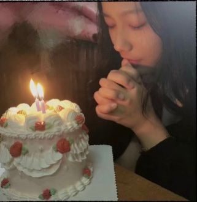

## 生日快乐

> <b>修改config.js的配置就可以为您心爱的人做一个超具创意的网页生日快乐呀,喜欢的话fork or star一下呗~</b>



## TODO
* [x] 每行祝福文字可以配一张图片
* [ ] 配图支持旋转

### config.js 说明
> 温馨提示: 每句话丶每个图片地址丶每个按钮文字的那一行，最后都要以**英文逗号**结尾哦！
```text
var config = {
    // 句子的长度可以任意， 你可以写十句话， 二十句话都可以
    // 每句话尽量不要超过15个字,不然展示效果可能不太好
    texts: [
        "嘿！小姑凉，新年好！",
        "好像用错了时候，哈哈哈",
        "无所谓了，新的一岁里",
        "祝愿你，生活里有热汤和甜食",
        "背包里有书本和远方",
        "一切困难都能云淡风轻",
        "每身孤独都能拥抱共鸣",
        "长夜里总有梦想发亮，秋收春耕",
        "人海中常有良友相伴，长乐未央",
        "希望你能遇见一切美好的人和事",
        "从此暗中有光",
        "心中向阳",
        "眼中有星辰",
        "愿你一生被爱",
        "想要的都拥有",
        "得不到的都释怀",
        "沧海桑田后依旧乘风破浪",
        "尘埃落定后依旧炙热欢畅",
        "其实这些话,都是网上抄的",
        "但祝福是真的",
        "只愿你被这世界温柔相待",
        "生日,它快不快乐我不关心",
        "因为我不认识它",
        "在这个世界上",
        "我希望你是快乐的",
        "都自由，都拥有",
        "特喜欢村上春树一句话：",
        "不必太纠结于当下",
        "也不必太忧虑未来",
        "当你经历过一些事情的时候",
        "眼前的风景已经和从前不一样了",
        "其实哪里会有人喜欢孤独",
        "不过是不喜欢失望",
        "愿你遇到一个成熟的爱人",
        "一辈子不用长大",
        "最后祝愿你",
        "所求皆如愿",
        "所行化坦途",
        "多喜乐",
        "长安宁",
        "生日快乐！",
    ],
    /**
     * imgs 可以不填, 但是如果要填写的话必须遵循下面的格式
     * "对应上面的文字, 要完全一样" : "图片地址, 可以把图片放在imgs文件夹中"
     * 例如
     * "心爱的小可爱": "./imgs/xiaokeai.jpg"
     *
     * 如果不要图片的话, 直接在每行开头写两个斜杠注释即可, 例如下面的 "今天是你的生日" 的图片就不会展示了:)
     * Tip: 图片最好用正方形or接近正方形, 看起来效果更好
     */
    imgs: {
        "心爱的小可爱": "./imgs/xiaokeai.png",
        // "今天是你的生日": "./imgs/birthday.jpg",
    },
    // 按钮文字描述, 以下是默认的按钮文字，英文的，您可以改成你喜欢的文字
    desc: {
        turn_on: "开始",
        play: "音乐",
        bannar_coming: "彩带",
        balloons_flying: "好像少点东西",
        cake_fadein: "蛋糕？",
        light_candle: "蜡烛？",
        wish_message: "生日快乐",
        story: "A MESSAGE FOR YOU",
    }
};
```